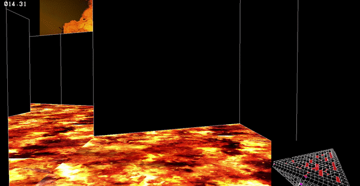

# HUAKE : Final Group Project for Soji's Engineering Computation Class

Author: Wooshik Kim, Yunsik Ohm, Jaejun Lee, Zhao Lu

Last edited: 12/3/2018

## Overview 

This is the result of group effort of Huake team. We made a 3D maze for Engineering Computation class. It includes multiple functionality that can also be used for other things. The game engine is capable of doing 1) forward kinematics 2) collision detection 3) visualization with texture mapping + minimap as part of game interface 4) music playing 5) writing and reading text file for keeping records. 

## Title Screen
Title screen is a great example of how well our kinematics is implemented. There are four planes that forms a tetrahedron. And on each plane there are many walls which are defined relative to the corresponding plane. Also there is the camera position and coordinate that is constantly rotating at the title screen.  

## Game Screen
Same kinematics is used here to move around in the correct direction and changing orientation of the view. 

## Transition
The transition takes place when player makes contact with one of the doors located on three sides. 

## Minimap
There is another camera that is located away from the player that gives the bird eye view. 

